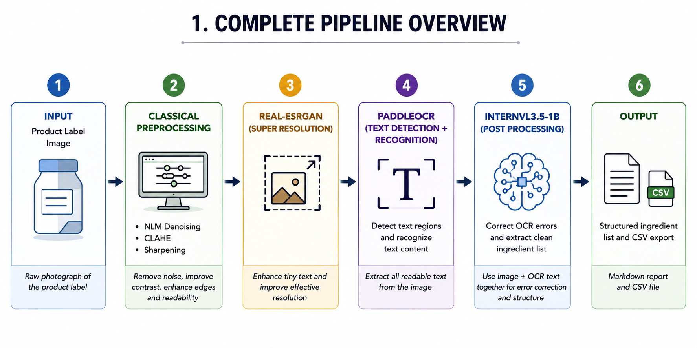
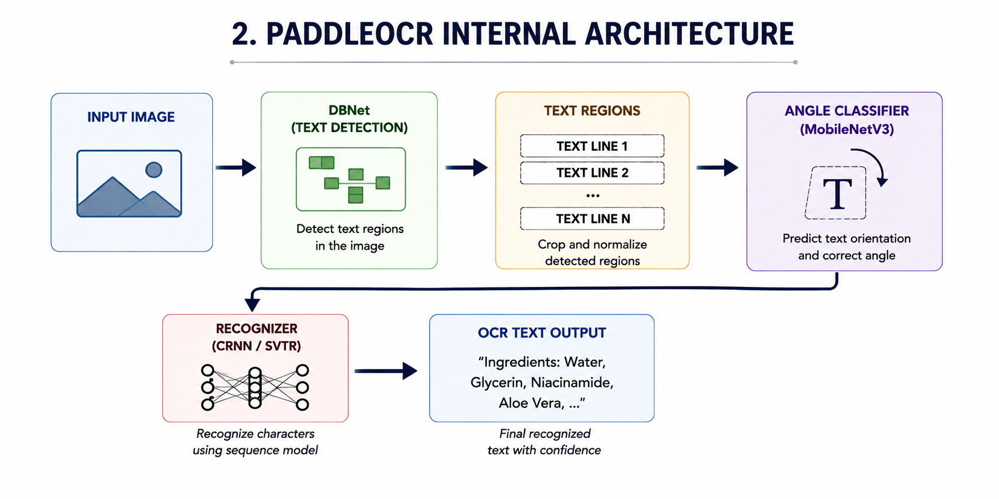
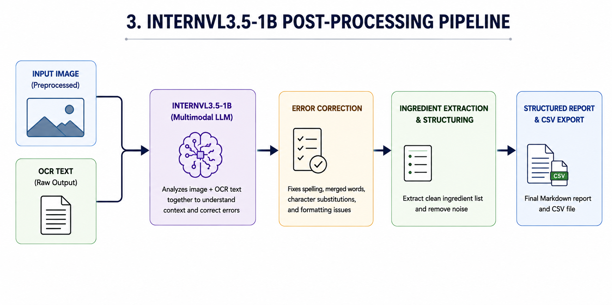
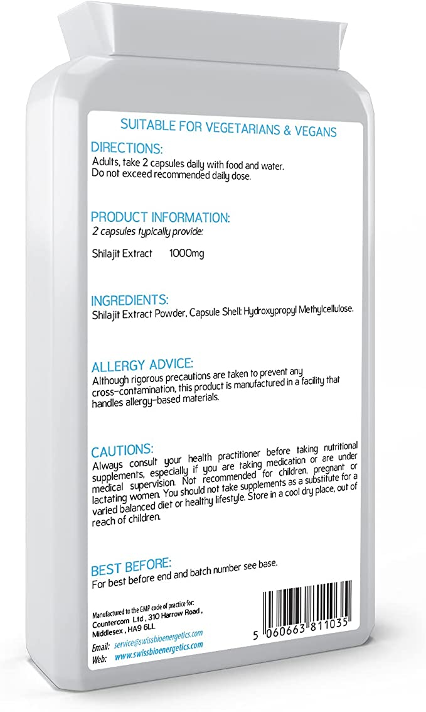
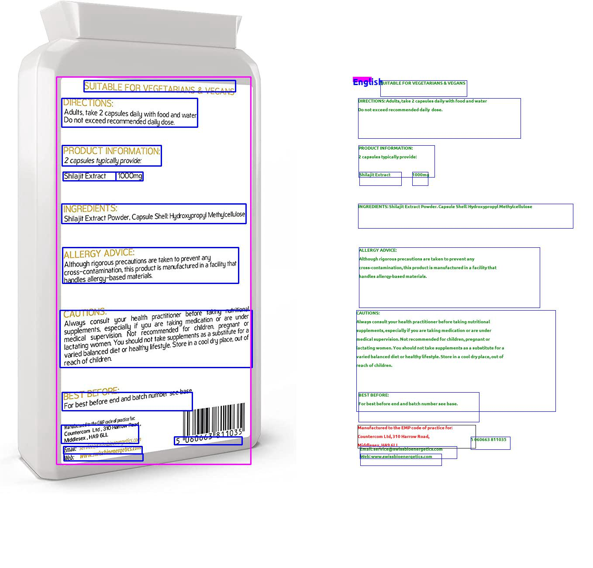

# Aayush_Intern_June_2026

# OCR-Based Ingredient Extraction from Product Label Images

A deep learning pipeline that automatically detects, reads, corrects, and structures
ingredient information from product label photographs using classical computer vision,
deep learning preprocessing, PaddleOCR, and InternVL3.5-1B multimodal language model.

---

## Table of Contents

1. [What This Pipeline Does](#1-what-this-pipeline-does)
2. [Why This Problem is Hard](#2-why-this-problem-is-hard)
3. [Complete Pipeline Flowchart](#3-complete-pipeline-flowchart)
4. [Stage 1 - Image Acquisition](#4-stage-1--image-acquisition)
5. [Stage 2 - Classical Preprocessing](#5-stage-2--classical-preprocessing)
6. [Stage 3 - Deep Learning Preprocessing](#6-stage-3--deep-learning-preprocessing-real-esrgan)
7. [Stage 4 - PaddleOCR](#7-stage-4--paddleocr-text-detection-and-recognition)
8. [Stage 5 - InternVL Post-Processing](#8-stage-5--internvl35-1b-post-processing)
9. [Stage 6 - Output and CSV Export](#9-stage-6--output-and-csv-export)
10. [How All Stages Connect](#10-how-all-stages-connect)
11. [Model Details](#11-model-details)
12. [Cell-by-Cell Explanation](#12-cell-by-cell-explanation)
13. [Setup Instructions](#13-setup-instructions)
14. [Project Structure](#14-project-structure)
15. [References](#15-references)

---

## 1. What This Pipeline Does

When you photograph a product label, the ingredient text printed on it is not
machine-readable. It is just pixels in an image. This pipeline takes that photograph
and produces a clean, structured, error-corrected text output containing the full
ingredient list.
**Pipeline Overview**

1. Raw product label photograph
2. Classical preprocessing (NLM Denoising, CLAHE, and Unsharp Masking)
3. Deep learning enhancement using Real-ESRGAN
4. Text detection and recognition using PaddleOCR
5. OCR correction and structured extraction using InternVL3.5-1B
6. Export of extracted ingredients to Markdown reports and CSV files
---
## 2. Why This Problem is Hard

Reading text from a product label photograph is significantly harder than reading
a scanned document. A scanner produces a perfectly flat, evenly lit, high-resolution
image. A phone photograph of a product label has all of the following problems:

**Problem 1 - Sensor noise**
Every camera sensor adds random electronic noise. To an OCR engine this looks like
thousands of tiny marks everywhere, confusing character detection.

**Problem 2 - Uneven lighting**
Flash hits the centre strongly and fades toward edges. Curved bottle surfaces tilt
away from the light. Some text is readable while other text on the same label is dark.

**Problem 3 - Blur and soft edges**
Tiny hand movement or autofocus at the wrong depth produces blurry text. Character
edges are gradients across several pixels instead of sharp one-pixel transitions.

**Problem 4 - Low effective resolution**
Ingredient lists use 6-8 point font. At normal shooting distance, each character
may be only 8-12 pixels tall. OCR models need at least 32 pixels to read accurately.

**Problem 5 - Curved surfaces**
Bottles wrap labels around a cylindrical surface. Text at the label edges curves
away from the camera, creating perspective distortion.

**Problem 6 - OCR errors**
Even after good detection, OCR makes errors:
- Words merge (refill4x instead of refill 4x)
- Characters substituted (qlucose instead of glucose)
- Numbers confused with letters (0 and O, 1 and l)

Each stage of this pipeline addresses one or more of these problems specifically.

---

## 3. Complete Pipeline Flowchart

<p align="center">
  
</p>

---

## 4. Stage 1 - Image Acquisition

The pipeline starts with a raw photograph uploaded manually through Google Colabs
file upload interface. The image is saved to `data/raw_images/`.

The upload cell supports multiple images selected simultaneously in a single
operation. At this stage the image is exactly as the camera captured it with all
photographic imperfections present.

---

## 5. Stage 2 - Classical Preprocessing

Classical preprocessing uses mathematical operations defined by human experts
rather than patterns learned from data. Three techniques are applied in sequence.
The order is deliberately chosen so each technique operates on the cleanest
possible input from the previous step.

### Step A - NLM Denoising

**Problem solved:** Camera sensor noise appearing as grain across the entire image.

NLM (Non-Local Means) exploits the fact that natural images contain repeated
textures. For each pixel, it takes a 7x7 patch around it, searches a 21x21 region
for similar patches, and replaces the pixel with a weighted average of similar
patches. Random noise cancels out during averaging while real edges are preserved.

The key advantage over Gaussian blur: NLM preserves sharp edges between ink and
background. Gaussian blur would also remove noise but soften every character edge.

Parameters used: h=10 (noise removal strength), template window 7x7, search 21x21.

**Runs first** so that CLAHE and sharpening operate on a noise-free base.

### Step B - CLAHE

**Problem solved:** Uneven lighting across the label surface.

Standard histogram equalisation adjusts contrast globally, over-amplifying bright
regions while still not improving dark regions enough. CLAHE divides the image into
64 tiles (8x8 grid) and applies histogram equalisation independently to each tile.
The clipLimit=3.0 prevents any tile from being over-amplified which would create
visible halos.

Applied only to the L (Lightness) channel in LAB colour space. This ensures only
brightness is adjusted and the colours of text and background stay unchanged.

**Runs after NLM** so it enhances clean signal rather than amplifying noise.

### Step C - Unsharp Masking

**Problem solved:** Blurry text and soft character edges.
Formula: Sharpened = 1.8 x Original - 0.8 x Blurred

= Original + 0.8 x (Original - Blurred)

= Original + 0.8 x edge_signal

The edge signal (Original minus Blurred) contains only fine details and transitions.
Adding it back with amplification makes character strokes sharper and more distinct.

Parameters: Gaussian sigma=2.0 captures medium-frequency edges. Weight 1.8/-0.8
provides strong but not excessive sharpening.

**Runs last in classical preprocessing** so it sharpens clean, evenly-lit content.

---

## 6. Stage 3 - Deep Learning Preprocessing (Real-ESRGAN)

**Problem solved:** Low effective resolution for small font ingredient text.

Classical techniques can only rearrange existing pixel information. When ingredient
text is 8-12 pixels tall, there are too few pixels to represent fine character
detail. Real-ESRGAN reconstructs plausible detail that the camera never captured.

### Architecture - RRDBNet

The RRDBNet architecture used by Real-ESRGAN consists of:

1. **Input Convolution Layer** – Extracts low-level image features from the input image.
2. **23 Residual-in-Residual Dense Blocks (RRDBs)** – Performs deep feature extraction using dense connections and residual learning.
3. **Pixel Shuffle Upsampling (×4)** – Increases image resolution by a factor of four while preserving learned features.
4. **Final Convolution Layers** – Reconstructs the enhanced high-quality image from the extracted features.

This architecture enables Real-ESRGAN to recover fine character details and improve OCR readability on low-resolution ingredient labels.

### The Resize-Back Step

After upscaling 4x, the image is resized back to original dimensions using
Lanczos4 interpolation. This keeps image size consistent for PaddleOCR so that
bounding box coordinates remain correctly scaled. The enhancement is captured as
increased pixel quality within the same image dimensions.

### Why Real-ESRGAN Runs Last

Running it after NLM denoising means the network only upscales clean signal.
If it ran on the raw noisy image it would upscale the noise as well.

---

## 7. Stage 4 - PaddleOCR Text Detection and Recognition

<p align="center">
  
</p>
PaddleOCR is called with `ocr.ocr(image_path, cls=True)` and runs three internal stages automatically.

### Sub-stage A - DBNet Text Detection

DBNet (Differentiable Binarisation Network) answers WHERE is the text?

The key innovation over earlier detectors is learning a per-pixel adaptive
threshold. Older methods used a fixed global threshold which caused adjacent
text lines to merge into one blob. DBNet learns a different threshold for every
pixel so boundaries between adjacent lines are cleanly separated.

Binarisation formula: B(x,y) = 1 / (1 + exp(-50 x (P(x,y) - T(x,y))))

P is the probability map (is this pixel text?). T is the threshold map (what
threshold makes the boundary crisp here?). With k=50, B approaches a hard
step function but remains smooth enough for gradient-based training.

After binarisation, contours are found with OpenCV, filtered by confidence
score above 0.6, and expanded outward by factor 1.5 (unclipping). DBNet is
trained on shrunk ground truth polygons to separate adjacent text, so unclipping
restores the full text region at inference time.

### Sub-stage B - Direction Classifier

MobileNetV3-Small classifies each 48x192 pixel text crop as:
- Class 0: upright (0 degrees) - pass to recogniser unchanged
- Class 1: upside-down (180 degrees) - rotate before recognition

Activated by `use_angle_cls=True` in the pipeline configuration.

### Sub-stage C - CRNN / SVTR + CTC Recognition

**CRNN (PP-OCR v1/v2):** CNN extracts left-to-right feature sequence.
BiLSTM processes sequence in both directions for context. CTC decoder
produces final text string.

**SVTR (PP-OCR v3/v4):** Replaces BiLSTM with Scene Text Visual Transformer.
Self-attention looks at all positions simultaneously instead of step-by-step.
Better at long text lines where LSTM loses context from the start.

**CTC decoding:**
Raw frames:        C  C  _  A  A  _  T  T   (_ = blank token)

Remove blanks:     C  C  A  A  T  T

Merge repeats:     C     A     T

Final output:      CAT

CTC allows training with word-level labels only. No character position
annotations are needed, making dataset creation much cheaper.

---

## 8. Stage 5 - InternVL3.5-1B Post-Processing

<p align="center">
  
</p>

### Why a Language Model is Needed After OCR

PaddleOCR produces imperfect output: merged words, character substitutions,
dropped detections, no understanding of which text belongs to which section.
InternVL fixes these by cross-referencing the image against the OCR text.

### Why InternVL3.5-1B

- **Open source:** No API keys, no cost, no data leaving the machine
- **Multimodal:** Accepts both image and text simultaneously
- **1B parameters:** Fits on free Colab T4 GPU (16GB VRAM) in bfloat16
- **HF native:** Uses standard transformers without custom code

### Vision Branch

The vision encoder processes the preprocessed image through the following stages:

1. Resize the image to **448 × 448 pixels**.
2. Split the image into **14 × 14 patches**.
3. Encode visual information using the **InternViT encoder**.
4. Generate **256 visual tokens**, each with 1024 dimensions.
5. Project visual tokens into the language model space using a two-layer **MLP Projector** (1024 → 4096 dimensions).

### Text Branch

The textual input consists of:

1. The system prompt containing extraction instructions.
2. Raw OCR text generated by PaddleOCR.

The tokenizer converts this information into a sequence of text tokens represented in the same 4096-dimensional embedding space used by the language model.


### Fusion

Both branches produce 4096-dimensional embeddings that are merged into a single sequence before being processed by the language model.

```text
[IMG_START][v1...v256][IMG_END][Prompt Tokens][OCR Tokens][GENERATE]
```

### MLP Projector - The Bridge

InternViT and the LLM were trained separately. Their internal vector spaces
are completely different. The MLP projector translates visual vectors into
the LLM vector space.

It is trained jointly with the rest of InternVL. During training, gradients
flow backward through the LLM, through the projector, and into InternViT,
teaching the projector what transformation makes the LLM produce correct answers
from visual input.

Architecture:
- Input: 256 vectors of 1024 dimensions (from InternViT)
- Linear 1024 -> 4096
- GELU activation (adds non-linearity so layers cannot collapse into one)
- Linear 4096 -> 4096
- Output: 256 vectors of 4096 dimensions (ready for LLM)

### Self-Attention - Where Fusion Happens

In each transformer layer, every token attends to every other token:
For generating the word "glucose":

Token attends to image patches around where that word appears (visual tokens)

Token attends to OCR text that said "qlucose" (text tokens)

Token attends to surrounding ingredient names (context tokens)

Model resolves conflict in favour of image (clearer signal + prompt instruction)

Output: "glucose"

### What the Model Gives More Preference To

1. Prompt instruction (strongest): "Use the image as primary source of truth"
2. Input quality: preprocessed image is high quality, OCR text has known errors
3. Sequence position: image tokens appear first, setting context for everything after

### Output Generation

The model generates the report one token at a time. Each new token attends to
all previous tokens plus the full input, so the report maintains consistency
throughout. Max 1024 tokens for full report, 512 tokens for ingredients only.

---

## 9. Stage 6 - Output and CSV Export

### Cell A - Full Structured Report per Image
Product Summary
Product name, form, strength, key identification
Directions
Dosage instructions, frequency, administration method
Ingredients
Complete ingredient list, OCR errors corrected
Allergy Advice and Cautions
Allergen warnings, contraindications, precautions
Contact / Manufacturer Information
Company name, address, batch number, expiry date

### Cell B - Ingredients Only per Image

- Ingredient 1
- Ingredient 2
- Ingredient 3
- ...


### CSV Export

Saved to `outputs/OCR_results/ingredients_output.csv` and automatically
downloaded to the local machine when the export cell runs.

| Image Name | Extracted Ingredients |
|---|---|
| image1.jpg | Water, sugar, citric acid, caffeine (0.04%), sucralose... |
| image2.jpg | Chrysanthemum Extract (66%), Water, Sugar, Acidity Regulator... |

The immediate download protects against Colab session loss.

---

## 10. How All Stages Connect

| Stage | Output | Consumed by |
|---|---|---|
| Image upload | data/raw_images/*.jpg | Stage 2 |
| Classical preprocessing | data/dl_preprocessed/*.jpg | Stage 3 |
| Real-ESRGAN | data/dl_preprocessed/*.jpg (overwritten) | Stage 4 and Stage 5 |
| PaddleOCR | all_results, target_ocr_paths | Stage 5 cells A and B |
| Cell A reports | structured_results_per_image dict | CSV export |
| Cell B ingredients | ingredients_results_per_image dict | CSV export |
| CSV export | outputs/OCR_results/*.csv | Downloaded to local PC |

**Key connection between Stage 4 and Stage 5:**

InternVL receives the following inputs for each image:

1. `path` – Preprocessed image from `data/dl_preprocessed/` (the same image processed by PaddleOCR).
2. `raw_text` – OCR text generated from PaddleOCR detections for that image.

```python
# In the post-processing loop:
preprocessed_image_path = path    # from target_ocr_paths (dl_preprocessed/)
raw_text = " ".join([line[1][0] for line in result[0]])
report = post_process_with_internvl(raw_text, image_path=preprocessed_image_path)
```

InternVL sees the fully preprocessed image (NLM + CLAHE + Sharpening + Real-ESRGAN),
not the raw original. This is the correct input for maximum accuracy.

---

## 11. Model Details

### PaddleOCR Configuration

| Parameter | Value | Reason |
|---|---|---|
| use_angle_cls | True | Handles upside-down text |
| lang | en | English character dictionary (96 chars) |
| use_gpu | True | 5-10x faster than CPU |
| show_log | False | Suppresses verbose output |
| det_db_thresh | 0.3 | Binary map threshold |
| det_db_box_thresh | 0.6 | Minimum polygon confidence |
| det_db_unclip_ratio | 1.5 | Polygon expansion factor |
| det_limit_side_len | 960 | Max image dimension |

### InternVL3.5-1B Configuration

| Parameter | Value | Reason |
|---|---|---|
| Model ID | OpenGVLab/InternVL3_5-1B-HF | Native HF, no version conflicts |
| dtype | torch.bfloat16 | Halves memory on T4 GPU |
| device_map | auto | Auto-places layers on GPU |
| do_sample | False | Deterministic reproducible output |
| max_new_tokens | 1024 (report) / 512 (ingredients) | Fits full output |
| repetition_penalty | 1.1 | Prevents repetitive loops |

### Real-ESRGAN Configuration

| Parameter | Value | Reason |
|---|---|---|
| Architecture | RRDBNet | State of art for super-resolution |
| num_block | 23 | Standard depth for x4 model |
| scale | 4 | 4x upsampling factor |
| tile | 0 | Process full image at once |
| half | True on GPU | FP16 for speed |

---
### Software Versions

The pipeline was developed and tested in Google Colab using the following software versions:

| Component    | Version                   |
| ------------ | ------------------------- |
| Google Colab | T4 GPU Runtime            |
| Python       | 3.x                       |
| PaddlePaddle | 3.3.1                     |
| PaddleOCR    | 2.7.3                     |
| PyTorch      | 2.11.0+cu128              |
| Transformers | Hugging Face Transformers |
| Real-ESRGAN  | x4plus                    |
| InternVL     | InternVL3.5-1B-HF         |

### Hardware Environment

| Component | Configuration                   |
| --------- | ------------------------------- |
| GPU       | NVIDIA T4 (16 GB VRAM)          |
| Runtime   | Google Colab                    |
| Precision | bfloat16 / FP16 where supported |

---

## 12. Cell-by-Cell Explanation

| Cell | Identified by first line | Description |
|---|---|---|
| 1 | pip uninstall -y paddleocr | Installs all packages. Sets FLAGS_use_onednn. |
| 2 | folders = ["data/raw_images" | Creates data/ and outputs/ directory structure. |
| 3 | from google.colab import files | Upload dialog. Saves images to data/raw_images/. |
| 4 | def apply_5_module_preprocessing | NLM + CLAHE + Unsharp Masking on all images. Saves to dl_preprocessed/. |
| 5 | import subprocess | Installs Real-ESRGAN. Downloads weights. Applies super-resolution to all preprocessed images. |
| 6 | import paddle | Patches PaddleOCR API. Initialises engine with GPU. |
| 7 | # Safe OCR Extraction | Runs PaddleOCR on every image. Populates all_results and target_ocr_paths. |
| 8 | if "all_results" in locals | Prints text block count per image. |
| 9 | if "all_images_detected_text" | Prints all detected text as flat numbered list. |
| 10 | if "all_results" in locals | Prints detected text grouped by image filename. |
| 11 | viz_paths = [f for f | Shows raw vs preprocessed side-by-side with OCR boxes drawn. |
| 12 | pip install -q -U transformers | Upgrades transformers. Installs InternVL dependencies. |
| 13 | import torch | Loads InternVL3.5-1B processor and model onto GPU. |
| 14 | def post_process_with_internvl | Defines function: sends image + OCR text -> full structured report. |
| 15 | def extract_ingredients_with_internvl | Defines function: sends image + OCR text -> ingredients list only. |
| 16 | def call_internvl | Shared inference helper used by both functions above. |
| 17 | structured_results_per_image = {} | Calls post_process_with_internvl for each image. Displays reports. |
| 18 | ingredients_results_per_image = {} | Calls extract_ingredients_with_internvl for each image. |
| 19 | import csv | Writes all ingredients to CSV. Auto-downloads to local machine. |
| 20 | data_folders = ["data/raw_images" | Clears data/ folders. Run after work is complete. |
| 21 | output_folders = ["outputs/visualizations" | Clears outputs/ folders. Run after downloading results. |

---

## 13. Setup Instructions

### Requirements

- Google account with access to Google Colab
- T4 GPU runtime (free tier is sufficient)
- No local installation required

### Step 1 - Open Notebook

Upload `paddle_pipeline.ipynb` to Google Colab or open directly from this
GitHub repository using the Open in Colab option.

### Step 2 - Switch to GPU Runtime
Runtime -> Change runtime type -> Hardware accelerator -> T4 GPU -> Save

Required for PaddleOCR GPU inference and Real-ESRGAN processing.

### Step 3 - Run All Cells in Order

Run every cell from top to bottom. Do not skip cells or run out of order.
Use Runtime -> Run all, or Shift+Enter on each cell individually.

### Step 4 - Upload Images When Prompted

Cell 3 shows a file picker. Select one or more product label images (JPG or PNG).

### Step 5 - Wait for Processing

Real-ESRGAN: approximately 2-5 seconds per image on T4 GPU.
InternVL: approximately 10-30 seconds per image depending on text length.

### Step 6 - Download Results

Cell 19 automatically downloads ingredients_output.csv to your local machine.
Structured reports are displayed in the notebook output cells.

---

## Dataset

### Dataset Availability

The dataset used in this project is private and is not publicly released.

If you require additional information regarding the dataset, annotation format, or potential research collaboration, please contact the repository maintainer.

### Dataset Characteristics

The dataset consists of real-world product label images containing:

* Ingredient information
* Product descriptions
* Directions and usage instructions
* Manufacturer information
* Allergy and caution statements
* Multi-line OCR regions
* Complex packaging layouts

### Example Dataset Sample

#### Input Image

<p align="center">
  
</p>

#### Annotation Example

<p align="center">
  
</p>

### Annotation Format

Each image is accompanied by a JSON annotation file containing:

* Language region bounding boxes
* OCR text region bounding boxes
* Ground-truth transcription text
* Cell-level OCR annotations

```json
{
  "language_bbox": [...],
  "cells_bbox": [...],
  "err_cells_bbox": [...]
}
```


## 14. Project Structure

```text
OCR-Ingredient-Extraction-Pipeline/
│
├── README.md
├── paddle_pipeline.ipynb
├── assets/
│   ├── 1.png
│   ├── 2.png
│   └── 3.png
└── outputs/
    └── ingredients_output.csv
```


### Files Excluded by `.gitignore`

- `data/` — Session-specific image data generated during runtime.
- `RealESRGAN_x4plus.pth` — Model weights downloaded automatically at runtime.
- `outputs/visualizations/` — Generated visualization images.
- `__pycache__/` — Python cache files.
- `.ipynb_checkpoints/` — Google Colab notebook checkpoints.

---

## 15. References

- PaddleOCR GitHub: https://github.com/PaddlePaddle/PaddleOCR
- PP-OCR Paper: https://arxiv.org/abs/2009.09941
- InternVL3 HuggingFace: https://huggingface.co/OpenGVLab/InternVL3_5-1B-HF
- Real-ESRGAN GitHub: https://github.com/xinntao/Real-ESRGAN
- Long, He and Yao (2021): Scene Text Detection and Recognition: The Deep Learning Era. International Journal of Computer Vision 129:161-184
- Ghai et al. (2025): Text Extraction System Techniques for Images. Multimedia Tools and Applications
